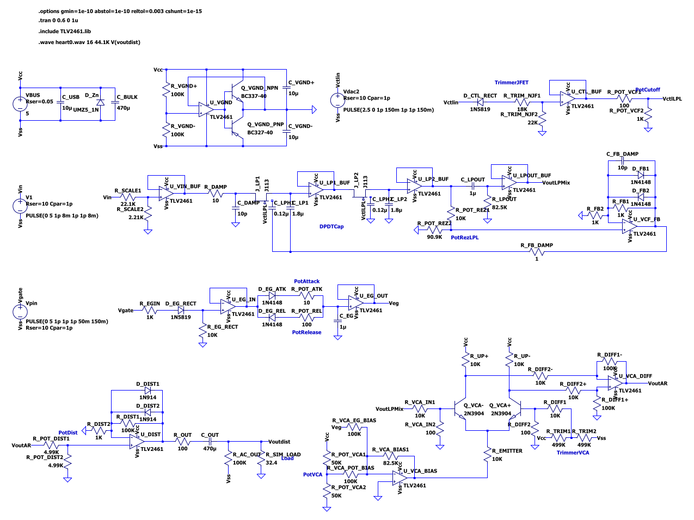

# Heart0
Firmware for a partially digital synthesizer, the ATmega328p handles MIDI, Filter Cutoff CV, Gate and Waveform generation, which is fed through analog stages.

The VCF is quite broken and needs to be reworked

